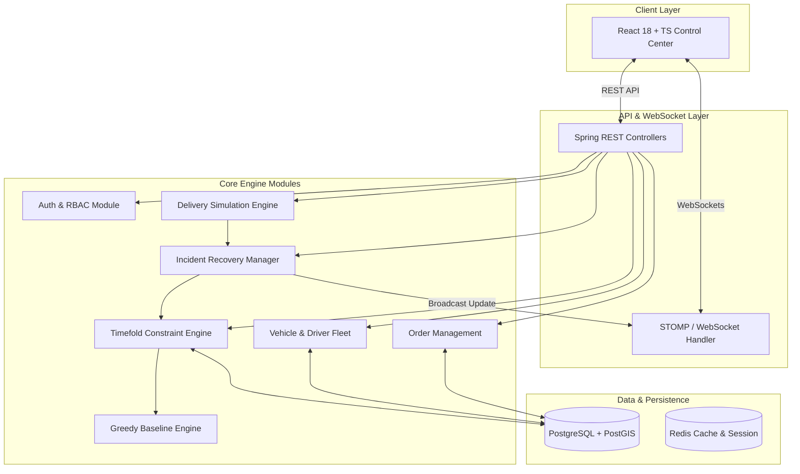

# RouteResQ — Project Overview

## 1. Executive Summary
**RouteResQ** is an enterprise-grade, real-time constraint-based last-mile delivery optimization and recovery platform. Built as a high-performance **Modular Monolith** using **Java 21, Spring Boot 3.3, and Timefold Solver 1.x**, RouteResQ enables logistics dispatchers to solve complex Vehicle Routing Problems with Time Windows (VRPTW) and dynamic fleet disruptions in real time.

Unlike simple route planners that compute static point-to-point shortest paths, RouteResQ dynamically optimizes multi-vehicle fleet assignments, respects complex operational constraints (vehicle capacity limits, customer delivery time windows, driver shift limits, depot returns), and provides immediate automated re-optimization when real-world incidents occur (e.g., vehicle breakdowns, driver unavailability, urgent order insertions).

---

## 2. The Core Logistics Problem
Last-mile delivery represents up to 53% of total shipping costs. Delivery companies face high operational friction:
- **Vehicle Routing Problem with Time Windows (VRPTW)**: NP-hard combinatorial problem where assigning $N$ orders across $V$ vehicles with strict arrival time windows yields $(V! \cdot N!)$ exponential search space complexity.
- **Dynamic Operational Disruptions**: Mid-day vehicle breakdowns or urgent customer orders require immediate route recalculation. Naive recalculation disrupts unaffected drivers or assigns impossible routes.
- **Sub-optimal Baseline Routing**: Manual or nearest-neighbor dispatching results in high fuel consumption, frequent late delivery SLA penalties, and poor vehicle capacity utilization.

---

## 3. Core System Capabilities

### Mode A: Static Route Planning
- Imports depots, vehicles, drivers, and delivery orders.
- Executes constraint satisfaction and local search optimization via **Timefold Solver**.
- Generates an optimal multi-vehicle sequence minimizing total travel distance and time while ensuring zero hard constraint violations.

### Mode B: Dynamic Incident Recovery & Re-Optimization
- Handles real-time events: `VEHICLE_BREAKDOWN`, `DRIVER_UNAVAILABLE`, `URGENT_ORDER`, `ORDER_CANCELLED`.
- Locks completed and in-progress stops to prevent driver confusion.
- Re-routes unassigned and affected orders to available nearby vehicles.
- Incorporates a **Route Stability Disruption Cost** penalty soft constraint to prevent unnecessary sequence changes for unaffected routes.
- Pushes real-time route updates to dispatchers via **WebSockets / STOMP**.

---

## 4. High-Level System Architecture Diagram

---

## 5. Key Differentiators & Engineering Value
1. **Constraint Optimization over Simple Pathfinding**: Solves multi-vehicle VRPTW using Timefold Solver instead of simple pairwise A* / Dijkstra path calculations.
2. **Disruption Cost Penalty (Route Stability)**: Re-optimization penalizes changing already-assigned future stops unless strictly necessary, balancing global optimality with operational predictability.
3. **Empirical Baseline Comparison**: Quantifies algorithm superiority by benchmarking Timefold against a Nearest-Neighbor Greedy dispatcher on identical operational datasets.
4. **Real-Time Event-Driven Architecture**: Uses Spring ApplicationEvents and WebSocket STOMP topics to render live route updates on an interactive Mapbox/Leaflet map without page refreshes.