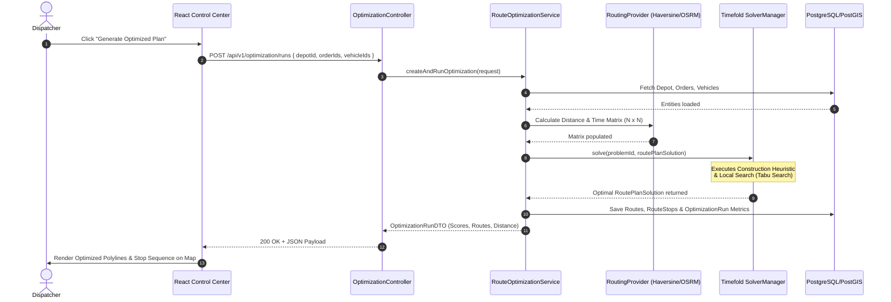
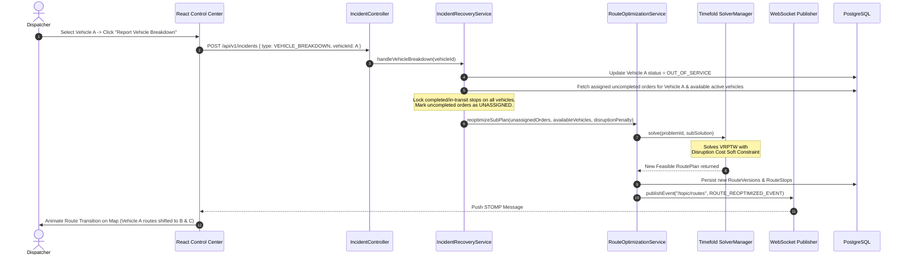

# System Architecture Specification

## 1. Modular Monolith Component Architecture

```mermaid
graph TB
    subgraph Client Tier
        UI[React 18 Dashboard SPA]
    end

    subgraph API Gateways & Security
        SecFilter[Spring Security Filter Chain - JWT]
        WSEndpoint[STOMP WebSocket Endpoint /ws-net]
    end

    subgraph Business Logic Modules (Modular Monolith)
        AuthMod[auth module]
        FleetMod[fleet module: Vehicle, Driver, Depot]
        OrderMod[order module: Order, Address]
        OptMod[optimization module: Timefold Solver, Constraints]
        BaseMod[baseline module: Nearest-Neighbor]
        IncMod[incident module: Recovery Manager]
        SimMod[simulation module: Fleet Simulator]
        NotifMod[notification module: WS Publisher]
    end

    subgraph Data & Storage Tier
        Flyway[Flyway Migrations]
        Postgres[(PostgreSQL 16 + PostGIS 3.4)]
        Redis[(Redis Cache - Spatial Matrix)]
    end

    UI -->|HTTPS REST| SecFilter
    UI <-->|WSS STOMP| WSEndpoint
    
    SecFilter --> AuthMod
    SecFilter --> FleetMod
    SecFilter --> OrderMod
    SecFilter --> OptMod
    SecFilter --> IncMod
    SecFilter --> SimMod

    OptMod --> FleetMod
    OptMod --> OrderMod
    OptMod --> BaseMod
    IncMod --> OptMod
    IncMod --> NotifMod
    SimMod --> NotifMod
    
    NotifMod --> WSEndpoint
    
    FleetMod --> Postgres
    OrderMod --> Postgres
    OptMod --> Redis
    Flyway --> Postgres
```

---

## 2. Sequence Diagrams for Key Workflows

### 2.1 Batch Route Optimization Sequence



---

### 2.2 Vehicle Breakdown Incident & Re-Optimization Sequence



---

## 3. Concurrency & Threading Model
1. **Spring Virtual Threads (Java 21)**: Web request handling executes on virtual threads, ensuring high throughput for REST calls and database queries.
2. **Timefold Solver Async Execution**: `SolverManager.solveBuilder()` offloads NP-hard solving to background worker threads, allowing non-blocking API polling or WebSocket progress broadcasts.
3. **Simulation Loop**: Scheduled single-thread executor (`TaskScheduler`) ticks every 1 second to advance vehicle positions along route polylines and publish WebSocket location updates.