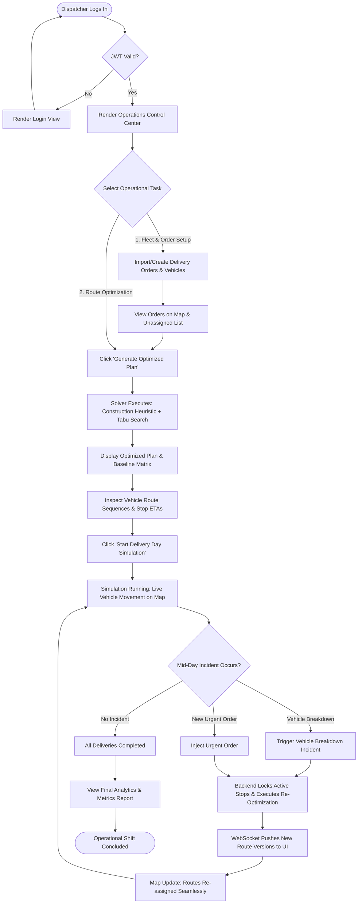

# Application Flow & User Journeys

## 1. Dispatcher End-to-End Operational Journey

---

## 2. Detailed Journey Steps

### Step 1: Authentication & Dashboard Initialization
- User enters credentials (`dispatcher@routeresq.io` / `password`).
- Backend returns JWT token + user details.
- React app initializes Mapbox/Leaflet container centered on Depot coordinates (e.g., Chicago Logistics Center: 41.8781° N, 87.6298° W).
- STOMP WebSocket connection established to `/ws-net`.

### Step 2: Order & Fleet Preparation
- Dispatcher clicks "Load Demo Dataset" or creates custom orders.
- Orders display delivery addresses, weight limits, and time windows (e.g., 09:00 - 11:30).
- Vehicles display max capacity (e.g., 500 kg) and driver assignments.

### Step 3: Optimization Execution & Baseline Audit
- Dispatcher clicks "Generate Optimized Plan".
- UI displays active solving spinner with timer.
- System executes dual run:
  1. **Nearest-Neighbor Baseline**: Sequential greedy assignment.
  2. **Timefold Solver**: Constraint-based VRPTW solution.
- Results matrix presents side-by-side comparison: Total Distance (km), Total Duration (mins), Capacity Utilization (%), Hard Violations (0 vs N).

### Step 4: Real-Time Simulation & Incident Recovery
- Dispatcher clicks "Start Simulation" (1 sec real time = 1 min simulated time).
- Vehicle markers move along route polylines.
- Dispatcher selects Vehicle 2 and clicks "Simulate Vehicle Breakdown".
- System automatically locks completed stops on Vehicle 2, sets Vehicle 2 status to `OUT_OF_SERVICE`, extracts pending stops, and re-allocates them to Vehicle 1 and Vehicle 3.
- Map visually updates route polylines in real time without refreshing.