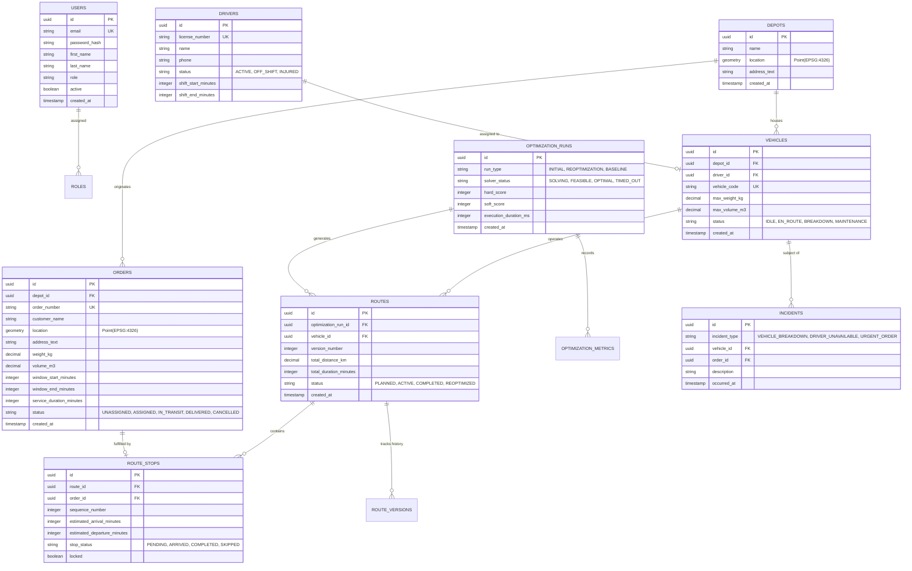

# Database Schema & Spatial Architecture

## 1. Relational Entity Relationship Diagram (ERD)



---

## 2. PostGIS Spatial Architecture & Indexing
- **Coordinate Reference System (CRS)**: WGS 84 (`EPSG:4326`) for latitude/longitude storage.
- **Spatial Column Type**: `geometry(Point, 4326)` on `depots` and `orders`.
- **Spatial Indexing**:
  ```sql
  CREATE INDEX idx_depots_location ON depots USING GIST (location);
  CREATE INDEX idx_orders_location ON orders USING GIST (location);
  ```
- **Spatial Distance Queries**:
  Uses `ST_DistanceSphere` for fast geodesic distance calculations in meters:
  ```sql
  SELECT id, customer_name, 
         ST_DistanceSphere(location, ST_MakePoint(-87.6298, 41.8781)) AS distance_meters
  FROM orders
  WHERE ST_DWithin(location, ST_MakePoint(-87.6298, 41.8781)::geography, 50000);
  ```

---

## 3. Core Table DDL Specifications

```sql
CREATE TABLE depots (
    id UUID PRIMARY KEY DEFAULT gen_random_uuid(),
    name VARCHAR(100) NOT NULL,
    location GEOMETRY(Point, 4326) NOT NULL,
    address_text TEXT NOT NULL,
    created_at TIMESTAMP WITH TIME ZONE DEFAULT CURRENT_TIMESTAMP
);

CREATE TABLE orders (
    id UUID PRIMARY KEY DEFAULT gen_random_uuid(),
    depot_id UUID NOT NULL REFERENCES depots(id),
    order_number VARCHAR(50) UNIQUE NOT NULL,
    customer_name VARCHAR(100) NOT NULL,
    location GEOMETRY(Point, 4326) NOT NULL,
    address_text TEXT NOT NULL,
    weight_kg NUMERIC(10, 2) NOT NULL CHECK (weight_kg > 0),
    volume_m3 NUMERIC(10, 2) DEFAULT 0.1,
    window_start_minutes INT NOT NULL, -- Minutes from midnight (e.g. 540 = 09:00)
    window_end_minutes INT NOT NULL,   -- Minutes from midnight (e.g. 660 = 11:00)
    service_duration_minutes INT DEFAULT 10,
    status VARCHAR(30) NOT NULL DEFAULT 'UNASSIGNED',
    version INT NOT NULL DEFAULT 0, -- Optimistic locking
    created_at TIMESTAMP WITH TIME ZONE DEFAULT CURRENT_TIMESTAMP
);

CREATE TABLE route_stops (
    id UUID PRIMARY KEY DEFAULT gen_random_uuid(),
    route_id UUID NOT NULL REFERENCES routes(id) ON DELETE CASCADE,
    order_id UUID REFERENCES orders(id),
    sequence_number INT NOT NULL,
    estimated_arrival_minutes INT NOT NULL,
    estimated_departure_minutes INT NOT NULL,
    stop_status VARCHAR(30) NOT NULL DEFAULT 'PENDING',
    locked BOOLEAN NOT NULL DEFAULT FALSE,
    CONSTRAINT uq_route_sequence UNIQUE (route_id, sequence_number)
);
```