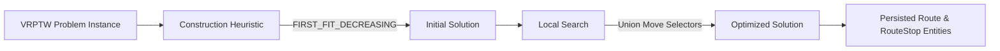

# Optimization Model (VRPTW & Timefold Solver)

## 1. Domain Modeling for Timefold Solver
RouteResQ models the **Vehicle Routing Problem with Time Windows (VRPTW)** using Timefold 1.11.0 domain annotations, keeping the solver domain strictly decoupled from JPA database entities.

### 1.1 Solution Class (`@PlanningSolution`)
`RoutePlanSolution` acts as the root object representing the entire fleet state for a given optimization job:
- **Planning Entities**: `List<TimefoldCustomer>` (`@PlanningEntityCollectionProperty`).
- **Problem Facts**: `List<TimefoldVehicle>`, `DistanceMatrix` (`@ProblemFactCollectionProperty`, `@ProblemFactProperty`).
- **Score**: `HardSoftScore` (`@PlanningScore`).

### 1.2 Entity Class (`@PlanningEntity`)
`TimefoldCustomer` represents a visit to a customer order location:
- **Planning Variable**: `previousStandstill` (`@PlanningVariable(graphType = PlanningVariableGraphType.CHAINED)`). Refers to either a preceding `TimefoldCustomer` or the starting `TimefoldVehicle`.
- **Standstill Interface**: Both `TimefoldVehicle` and `TimefoldCustomer` implement `Standstill`, providing a unified location abstraction.
- **Dynamic Arrival Time**: Calculated recursively via `getArrivalTimeMinutes(DistanceMatrix)` to maintain 100% thread-safety and zero state corruption across move evaluations.

---

## 2. Solving Algorithms & Configuration

### 2.1 Construction Heuristic
- **Strategy**: `FIRST_FIT_DECREASING`.
- **Entity Sorting**: `CustomerDifficultyComparator` sorts orders by window start, window end, and weight descending to build an intelligent initial chain.

### 2.2 Local Search
- **Move Selectors**:
  - `ChangeMoveSelectorConfig`: Moves a single stop between vehicles or positions.
  - `SwapMoveSelectorConfig`: Swaps two stops.
  - `SubChainChangeMoveSelectorConfig`: Moves an entire sub-chain of stops to another vehicle.
  - `SubChainSwapMoveSelectorConfig`: Swaps two sub-chains of stops.

---

## 3. Score Definition & Constraints
RouteResQ uses `HardSoftScore`:
- **Hard Score**: Must be `0` for a operational solution. Negative hard score indicates hard constraint violations (`H1` Vehicle Capacity, `H2` Time Window Lateness, `H3` Driver Shift Exceeded).
- **Soft Score**: Penalizes `S1` Leg Distance, `S4` Return-to-Depot Distance, `S2` Travel & Service Duration, and `S3` Vehicle Activation Count (`5,000` penalty per vehicle used).