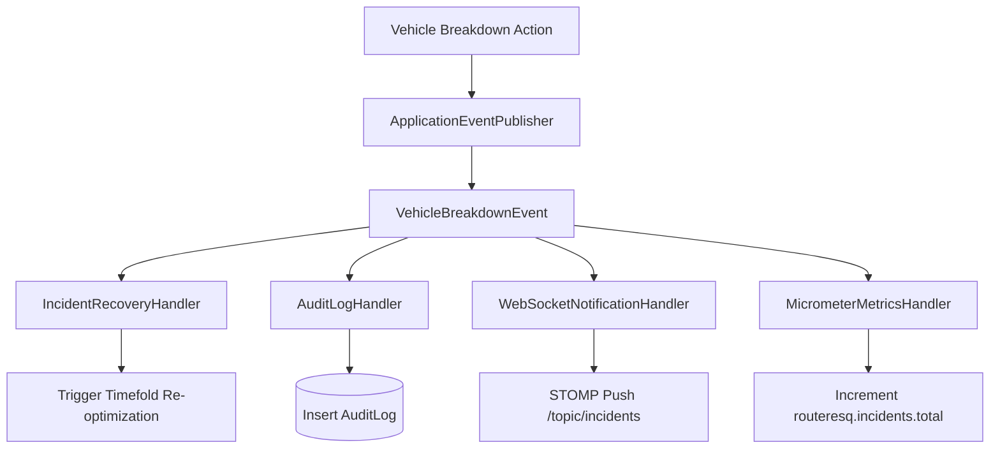

# Event Model & Domain Messaging

## 1. Domain Event Architecture
RouteResQ implements an event-driven domain architecture using Spring `ApplicationEventPublisher`. Domain events decouple core entity mutations from WebSocket notifications, audit logs, and analytical metrics.

---

## 2. Domain Event Catalog

| Event Name | Publisher | Payload Summary | Listeners |
|---|---|---|---|
| `OrderCreatedEvent` | OrderService | `orderId`, `depotId`, `weightKg`, `location` | MetricCounter, WSBroadcaster |
| `OptimizationCompletedEvent` | RouteOptimizationService | `runId`, `hardScore`, `softScore`, `durationMs` | AuditLogger, AnalyticsService |
| `VehicleBreakdownEvent` | IncidentService | `vehicleId`, `location`, `timestamp` | RecoveryHandler, WSBroadcaster |
| `DeliveryCompletedEvent` | SimulationService | `orderId`, `vehicleId`, `actualArrivalTime` | OrderService, MetricCounter |