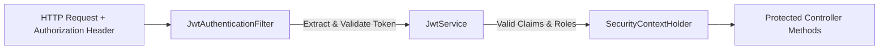

# Security Design & RBAC Specification

## 1. Security Architecture & Spring Security Filter Chain
RouteResQ implements stateless JWT (JSON Web Token) authentication backed by Spring Security 6 in a Spring Boot 3.3 Modular Monolith application.

### Key Security Components
- **`SecurityConfig`**: Configures `SessionCreationPolicy.STATELESS`, disables CSRF for stateless REST, configures CORS, and registers security filters.
- **`JwtService`**: Handles token generation, signature verification, expiration check, and subject/claim extraction.
- **`JwtAuthenticationFilter`**: Intercepts HTTP requests, parses `Authorization: Bearer <token>`, and populates Spring Security `SecurityContextHolder`.
- **`CustomUserDetailsService`**: Loads user records from PostgreSQL database via `UserRepository.findByEmail()`.
- **`RestAuthenticationEntryPoint`**: Intercepts unauthenticated requests and outputs 401 JSON error responses.
- **`RestAccessDeniedHandler`**: Intercepts forbidden role requests and outputs 403 JSON error responses.

---

## 2. Role-Based Access Control (RBAC) Matrix

| Endpoint Pattern | Method | ADMIN | DISPATCHER | DRIVER | Public |
|---|---|---|---|---|---|
| `/api/v1/auth/**` | POST | YES | YES | YES | YES |
| `/actuator/health`, `/actuator/info`, `/actuator/prometheus` | GET | YES | YES | YES | YES |
| `/ws-net/**` | WSS | YES | YES | YES | YES |
| `/api/v1/admin/**`, `/api/v1/users/**` | ALL | YES | NO | NO | NO |
| `/api/v1/optimization/**`, `/api/v1/simulation/**` | POST/GET | YES | YES | NO | NO |
| `/api/v1/incidents/**` | POST/GET | YES | YES | REPORT-ONLY | NO |
| `/api/v1/orders/**`, `/api/v1/vehicles/**`, `/api/v1/routes/**` | GET/PATCH | YES | YES | ASSIGNED-ONLY | NO |

---

## 3. Password Security & Secret Storage
- **Password Hashing**: BCrypt strength `12` via `BCryptPasswordEncoder`.
- **Token Expiration**: Access token default 15 minutes (900,000 ms); Refresh token default 7 days.
- **Configurable Secrets**: `JWT_SECRET`, `JWT_EXPIRATION_MS`, `CORS_ALLOWED_ORIGINS` injected via environment variables. Never hardcoded.

---

## 4. Development Credentials
For local development and testing, deterministic BCrypt-hashed credentials are created by `DataSeeder`:
- **Admin**: `admin@routeresq.io` / `admin123`
- **Dispatcher**: `dispatcher@routeresq.io` / `dispatch123`
- **Driver**: `driver@routeresq.io` / `driver123`

---

## 5. Token Storage Strategy & Security Trade-Offs
- **Web App Storage**: Access token stored in memory / localStorage by `tokenStorage.ts`.
- **Mitigations**: Short 15-minute token TTL limits window of vulnerability; stateful refresh token invalidation planned for production deployment; CORS restricted to configured frontend domains.