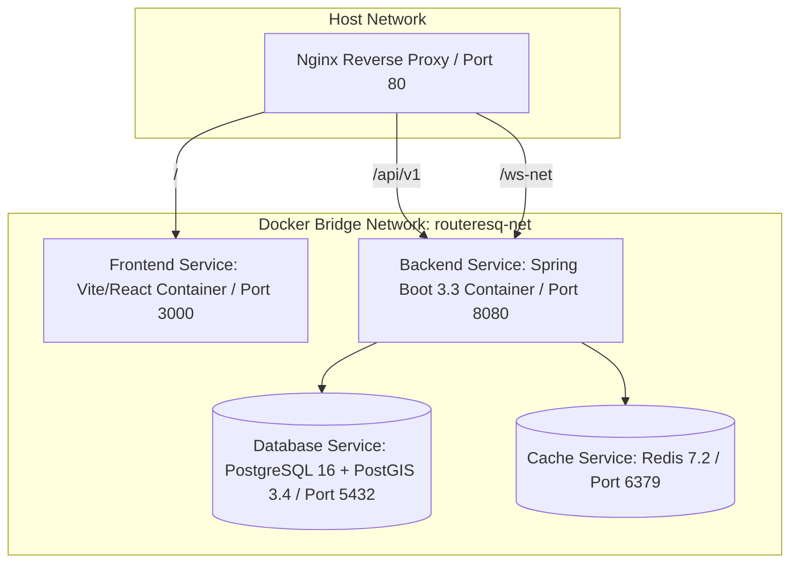

# Deployment & Infrastructure Architecture

## 1. Containerization Topology (`docker-compose.yml`)
RouteResQ is packaged into a multi-container Docker deployment.



---

## 2. Dockerfiles

### 2.1 Backend Multi-Stage Dockerfile (`backend/Dockerfile`)
```dockerfile
# Stage 1: Build Java artifact
FROM eclipse-temurin:21-jdk-alpine AS builder
WORKDIR /app
COPY pom.xml .
COPY src ./src
RUN ./mvnw clean package -DskipTests

# Stage 2: Runtime image
FROM eclipse-temurin:21-jre-alpine
WORKDIR /app
COPY --from=builder /app/target/routeresq-backend-*.jar app.jar
EXPOSE 8080
ENTRYPOINT ["java", "-jar", "app.jar"]
```

### 2.2 Frontend Multi-Stage Dockerfile (`frontend/Dockerfile`)
```dockerfile
# Stage 1: Build React static bundle
FROM node:20-alpine AS builder
WORKDIR /app
COPY package*.json ./
RUN npm ci
COPY . .
RUN npm run build

# Stage 2: Serve via Nginx
FROM nginx:alpine
COPY --from=builder /app/dist /usr/share/nginx/html
COPY nginx.conf /etc/nginx/conf.d/default.conf
EXPOSE 80
```